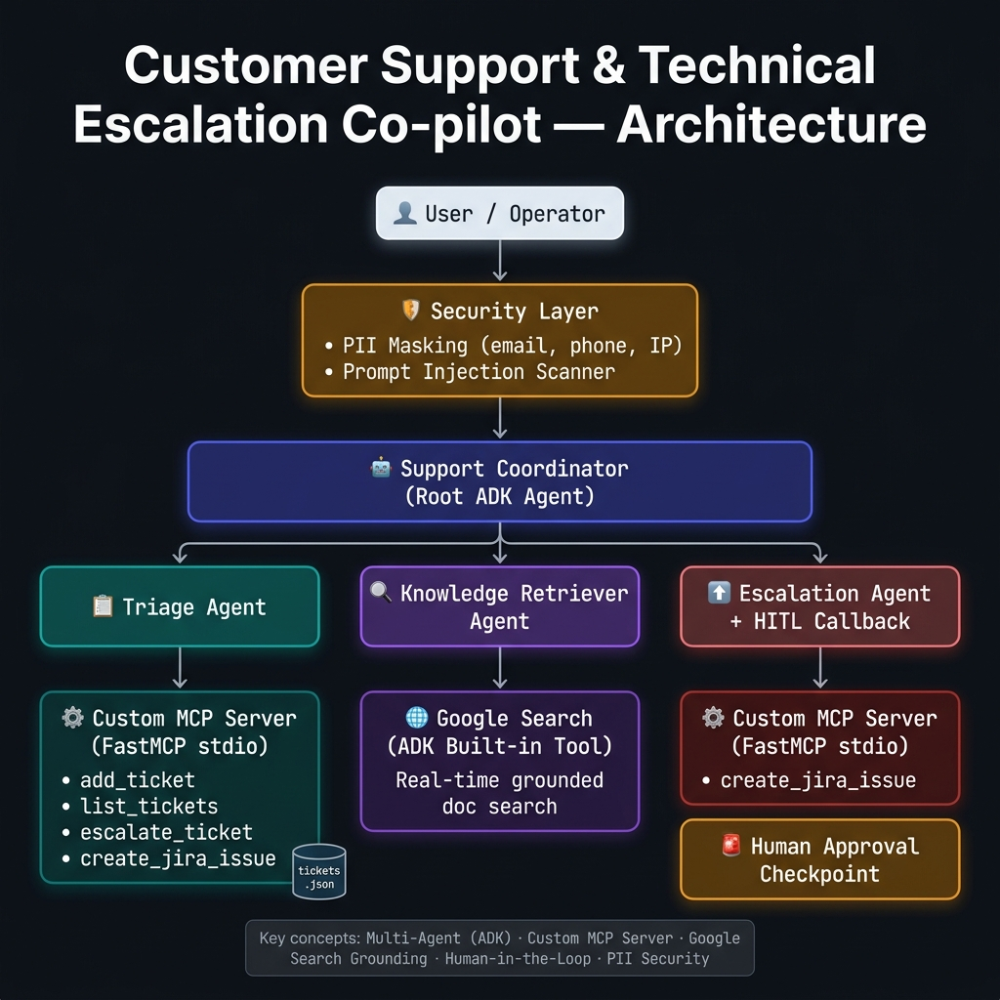

# 🤖 Customer Support & Technical Escalation Co-pilot

> **Kaggle 5-Day AI Agents Capstone Project** | Track: **Agents for Business**  
> 🔗 [github.com/ShegouB/support-copilot](https://github.com/ShegouB/support-copilot)

An enterprise-grade, AI-powered customer support co-pilot that automates ticket triage, grounded technical Q&A, and engineering escalation — built with **Google Agent Development Kit (ADK)**, a custom **FastMCP stdio server**, and real-time **Google Search grounding**.

---

## Architecture



The system is composed of four coordinated agents with a layered security pipeline:

```
User Input
    │
    ▼
🛡️  Security Layer          # PII masking + prompt injection scanner
    │
    ▼
🤖  Support Coordinator     # Root ADK agent — routes to specialist sub-agents
    ├── 📋 Triage Agent        → Custom MCP Server (FastMCP stdio) → tickets.json
    ├── 🔍 Knowledge Retriever → Google Search (ADK built-in, real-time grounding)
    └── ⬆️  Escalation Agent   → Custom MCP Server + 🚨 Human-in-the-Loop callback
```

---

## Key Features & Concepts Demonstrated

| ADK Course Concept | Implementation |
|---|---|
| **Multi-Agent System (ADK)** | 4-agent hierarchy: coordinator + 3 specialist sub-agents |
| **Custom MCP Server** | FastMCP stdio server exposing 4 ticket lifecycle tools |
| **Google Search Grounding** | `retriever_agent` uses ADK's `google_search` tool for real-time doc retrieval |
| **Security Features** | PII masking (regex), prompt injection scanner, HITL approval callback |
| **Deployability** | Dockerfile provided for Cloud Run deployment |

### Agent Details

**Support Coordinator** (Root)
- Automatically routes requests based on intent
- Delegates to the correct specialist — never answers technical questions directly

**Triage Agent**
- Classifies issues: `Bug | Question | Feature Request`
- Determines severity: `low | medium | high`
- Persists tickets via the custom MCP server → `tickets.json`

**Knowledge Retriever Agent**
- Uses ADK's built-in `google_search` tool for real-time, grounded answers
- Prioritises official sources: `adk.dev`, `cloud.google.com`, `developers.google.com`
- Always cites source URLs

**Escalation Agent**
- Escalates tickets to `high` severity
- Creates JIRA issues in the simulated engineering backlog
- Protected by a `before_tool_callback` that requires human approval before any write

### Security Pipeline

- **PII Masking**: Regex-based auto-redaction of emails, phone numbers, and IPs _before_ sending to the LLM
- **Prompt Injection Scanner**: Blocks known adversarial keywords (`ignore previous instructions`, `bypass safety`, etc.)
- **Human-in-the-Loop (HITL)**: `before_tool_callback` intercepts `create_jira_issue` calls and requires explicit operator confirmation

---

## Project Structure

```
kaggle/
├── app/
│   ├── agent.py          # Multi-agent definitions and tool wiring
│   ├── config.py         # Model + environment settings
│   ├── main.py           # Interactive CLI runner (ADK Runner + InMemorySessionService)
│   ├── mcp_server.py     # Custom FastMCP stdio server (4 tools, tickets.json backend)
│   └── security.py       # PII masking + prompt injection sanitizer
├── tests/
│   └── test_agents.py    # Pytest suite: security + MCP tool tests (3 tests)
├── docs/
│   └── architecture.png  # System architecture diagram
├── Dockerfile            # Cloud Run deployment container
├── requirements.txt
└── README.md
```

---

## Installation & Setup

### 1. Install dependencies

```bash
pip install -r requirements.txt
```

### 2. Configure API key

Create a `.env` file in the project root:

```env
GOOGLE_API_KEY="your-gemini-api-key-here"
```

> ⚠️ **Never commit your API key.** It is excluded from git via `.gitignore`.

---

## Running Locally

### Interactive CLI

```bash
python3 app/main.py
```

The CLI launches the MCP server as a stdio subprocess, applies the security pipeline to all input, and streams responses from the multi-agent system.

### Test Suite

```bash
python3 -m pytest tests/ -v
```

All 3 tests cover: PII masking, prompt injection blocking, and full MCP tool lifecycle (add → escalate → JIRA creation).

---

## Demo Scenarios

### 1. Triage & Classification

```
You: My name is Alice (alice@example.com). I'm getting a 403 error on Cloud Run.

🛡️ [PII Masked] Input sanitized to: "My name is Alice ([EMAIL_MASKED])..."

Agent: ✅ Ticket #3 created.
  Category: Bug | Severity: high | Status: open
```

### 2. Technical Q&A (Google Search Grounding)

```
You: How do I configure a before_tool_callback in Python ADK?

Agent: Based on the official ADK documentation (adk.dev/tools/...):
  The before_tool_callback is set on an Agent via the before_tool_callback=
  parameter. It receives (tool, args, tool_context) and can return a dict to
  short-circuit execution or None to allow it to proceed...
  Source: https://adk.dev/...
```

### 3. Human-in-the-Loop Escalation

```
You: Please escalate ticket 1 to JIRA.

==================================================
🚨 SECURITY GUARDRAIL: HUMAN-IN-THE-LOOP APPROVAL REQUIRED
  - Ticket ID: 1
  - Summary: Database connection timeout
Approve JIRA creation? (y/N): y

✅ Escalation approved.
Agent: JIRA issue ENG-101 created and linked to Ticket #1.
```

---

## Cloud Run Deployment

Build and deploy using the included `Dockerfile`:

```bash
# Build the container image
docker build -t support-copilot .

# Deploy to Cloud Run (requires Google Cloud project)
gcloud run deploy support-copilot \
  --source . \
  --region us-central1 \
  --project YOUR_PROJECT_ID \
  --set-env-vars="GOOGLE_API_KEY=your-key-here" \
  --allow-unauthenticated
```

Or use the ADK CLI:

```bash
adk deploy cloud_run \
  --project=YOUR_PROJECT_ID \
  --region=us-central1 \
  --service_name=support-copilot \
  ./app
```

> 🔒 **Security note**: Never embed API keys in the Docker image. Always inject them at deploy time via `--set-env-vars` or Cloud Run Secret Manager integration.

---

## Requirements

```
google-adk>=1.0.0
mcp>=1.0.0
python-dotenv
pydantic>=2.0.0
pytest
pytest-asyncio
```

Python 3.12+ recommended.
